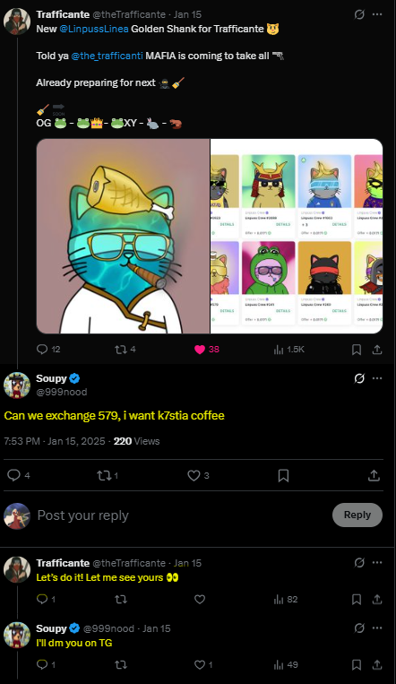

# SWORP

## ⚠ Problem
Nft asset exchanges on social media are often risky. Typically, it requires one party (usually the person that sends their asset first)to
trust the other. An alternative is to use an offchain escrow, but this introduces another trust layer in which both parties would have to trust the escrow provider.

## 🛠 Solution
Sworp is a trustless, peer-to-peer NFT swapping protocol that enables secure and decentralized exchanges of NFTs between two parties. It removes intermediaries and offers full protection of user assets throughout the swap process.

## 🔁How It Works
* User A (**requester**) initiate a swap order, proposing to exchange their Nft(s) for an Nft(s) owned by User B(**Fulfiller**).
* Sworp smart contract takes custody of user A's Nft(s) and sends the offer to user B's inbox
* User B can either
    
    - **Accept** : The contract performs the swap and transfers the NFT(s) accordingly.
    - **Reject**: User A's NFTs are returned.

* user A may also cancel the request any time before user B responds, ensuring assets are not locked indefinitely.

## 🔍Current Features
- 🔐 Trustless Peer to Peer NFT swaps with no central authority
- 🔁 Flexible Swap Types:
    - 1-to-1
    - 1-to-many
    - many-to-1
    - many-to-many(up to 15 NFTs per transaction)
- ✅ Core Actions: Create, cancel, accept, or reject offers with ease.  

## 🗺 Roadmap
- [x] 💲 Add support for FT (fungible tokens) in swap orders (e.g Chain-Native Coin or ERC20 tokens).

- [ ] Direct NFT swaps for FT

- [ ] ⛓⛏ Deploy on multiple evm chain

- [ ] 🔗 Enable cross-chain NFT swaps

- [ ] Cross-chain NFT(s) to FT swaps

- [ ] 🔍👾 Audits

- [ ] 🏗 Production Deployment

## 👥Who Is This For
Sworp is designed to empower various participants in the NFT and web3 ecosystem by providing a safer, decentralized way to trade valuable digital assets:

### 🎨 NFT Collectors & Traders
Traditional over-the-counter trades on social media are risky and prone to scams. Sworp offers a secure way to directly swap NFTs with other collectors; no need to "go first" or rely on sketchy middlemen.

### 👥Web3 Communities and Daos
DAO and NFT community members can use Sworp for fair, verifiable swaps between members, ideal for cross-collection events or internal trades.

### 🎮 Web3 Gamers
Sworp enables gamers to securely exchange in-game NFT assets with other players directly, no middlemen and no risk of getting scammed.

### 🛠 Builders & Developers
Sworp is modular and on-chain, making it a great base for integrating into marketplaces, wallets, or community dApps.

## 💡Inspiration
This project was inspired by an <a href="https://x.com/999nood/status/1879602719293686124">interaction</a> between user <a href="https://x.com/999nood">@999nood</a> and <a href="https://x.com/theTrafficante">@Trafficante</a> on X. 

