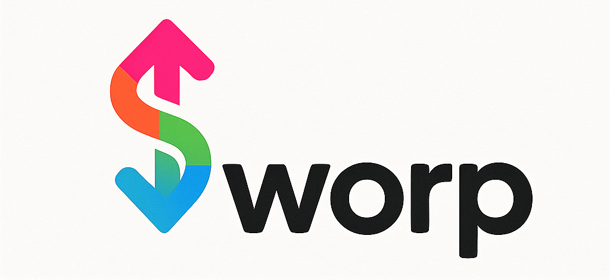
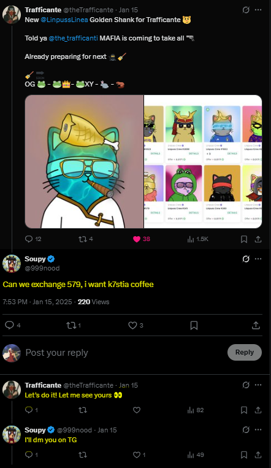

Peer-to-peer Nft asset exchanges with strangers pn the internet are often risky. Typically, it requires one party (usually the person that sends their asset first) to
trust the other. An alternative is to use an offchain escrow, but this introduces another trust layer in which both parties would have to trust the escrow provider.

## 🛠 Solution
> **Sworp** is a trustless, peer-to-peer NFT swapping protocol that enables secure and decentralized exchanges of NFTs between two parties. It removes intermediaries and offers full protection of user assets throughout the swap process.

## 🔁How It Works

Sworp offers a range of options that allows user to easily swap nft assets with peers in a safe and secure manner.

**Swap Order Combinations:**
- `NFT ==> NFT`
- `NFT ==> NFT + FT(ETH/ERC20)` 
- `NFT + FT ==> NFT + FT(ETH/ERC20)` 
- `NFT + FT(ETH/ERC20) ==> NFT`

**Swap Order categories includes:**
1. **`Public Swap Order`**: Public swap order allows users to put their assets up in exchange for ones that can typically be matched by anyone. For instance a user might put up their NFT up for swap for any NFT from the same or a different collection, so any holder of that collection is typically allowed to match the order with whatever tokenId they're holding. 

    **Best suited for cases where**:
    - The order creator want to swap their NFT
 (s) for another NFT(s) from the same or a 
different collection with or without added fungible tokens without caring about the specifics of the NFT(s)
    - The order creator wants to swap their NFT(s) directly for a fungible token.

2. **`Targeted Swap Order:`** This type of order basically allows a user to select a number of specifc assets they're willing to swap their assets for. Only holders of those assets can match the order.
 **Best suited for cases where:** 
    - order creator wants specific tokens from the same or different collections with or without fungible tokens involved.

3. **`Private Swap Order:`** This type of orders is best suitable for peers who are farmiliar with one another, It allows a user to direct an order to a specific address and only that address can match the other regardless if there are other people who have the required assets to match it. 

## 🔍Current Features
- 🔐 Trustless Peer to Peer NFT swaps with no central authority
- 🔁 Flexible swap types allowing up to 5 NFTS per transaction with the ability to include or request fungibles as part of the deal.

- ✅ Core Actions: Create, cancel, accept, swap offers with ease.  

## 🗺 Roadmap

- [ ] Offer based batering allowing matchers to present a counter proposal to the order creator, leaving room for negotiation.

- [ ] ⛓⛏ Deploy on multiple evm chain

- [ ] 🔗 Cross-chain swaps

- [ ] 🔍👾 Audits

- [ ] 🏗 Production Deployment

## 👥Who Is This For
**Sworp** is designed to empower various participants in the NFT and web3 ecosystem by providing a safer, decentralized way to trade valuable digital assets peer-to-peer style:

### 🎨 NFT Collectors & Traders
Traditional over-the-counter trades on social media are risky and prone to scams. Sworp offers a secure way to directly swap NFTs with other collectors; no need to "go first" or rely on sketchy middlemen.

### 👥Web3 Communities and Daos
DAO and NFT community members can use Sworp for fair, verifiable swaps between members, ideal for cross-collection events or internal trades.

### 🎮 Web3 Gamers
Sworp enables gamers to securely exchange in-game NFT assets with other players directly, no middlemen and no risk of getting scammed.

### 🛠 Builders & Developers
Sworp is modular and on-chain, making it a great base for integrating into marketplaces, wallets, or community dApps.

## 💡Inspiration
This project was inspired by an <a href="https://x.com/999nood/status/1879602719293686124">interaction</a> between user <a href="https://x.com/999nood">@999nood</a> and <a href="https://x.com/theTrafficante">@Trafficante</a> on X. 

